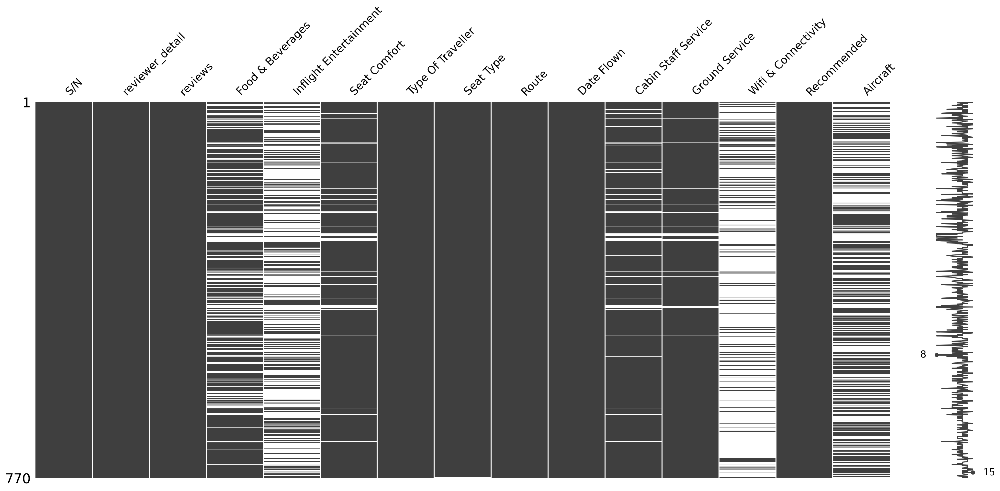
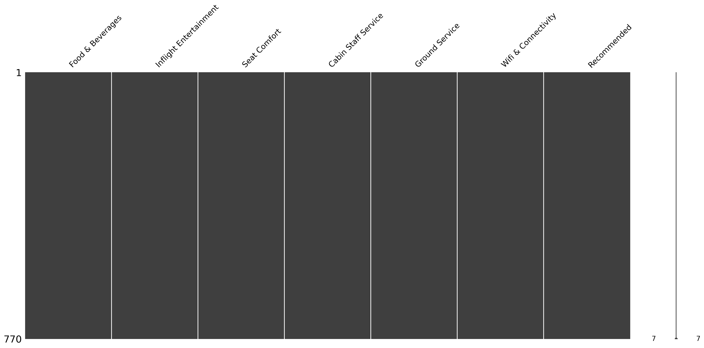

# LEVERAGING CUSTOMERS' DATA FOR CUSTOMER SATISFACTION AND OPERATIONAL EFFICIENCY IMPROVEMENTS IN BRITISH AIRWAYS SHORT-HAUL FLIGHTS.
## Data Analytics project - Aviation
### Project Overview

The project aims to uncover Data-driven strategies that can help British Airways optimise short-haul flight services, offering recommendations for operational improvements.
British Airways (BA) customers' data was minined aand analysed to identify customer satisfaction and operational efficiency improvement areas for BA's short-haul flights. 
Determination of the most critical customer satisfaction factors and how these factors can also guide the efficient allocation of service costs in British airways is a key focus of this project.

### Data Sources
OCRs: The data source for this analysis is Online Customer Reviews (OCRs) from British Airways passengers. 
The OCRs are collected from Skytrax (an Airline Reviews and Ratings website) - ‘https://www.airlinequality.com/airline-reviews/british-airways’.
‘requests’,‘BeautifulSoup’ and ‘pandas’ libraries are used to extract the data and store to CSV saved as ‘British Airways-Final-Data-Skytrax.csv’.

### Tools 
- Python (Gooogle Colab) - Data Cleaning and Analysis
- Power BI - Report Visualisation

### Data Cleaning/Preparation
In the data preparation stage, the following tasks were performed
1. Data was extracted with python web scraping tool from ‘https://www.airlinequality.com/airline-reviews/british-airways’
2. Data was loaded and inspected
3. Personal details of customers in the data are filtered out for this analysis in line with standard ethical considerations
4. Missing values were handled
5. Data was cleaned and formatted

### Exploratory Data Analysis
EDA involved exploring the Online Customer Reviews' Data (OCRs) to answer key questions such as:

1. Which customer data points most predictive of customer satisfaction and operational efficiency in British Airways short-haul flights?
2. What are the primary factors influencing customer recommendations of British Airways’ short-haul services?
3. Can operational efficiency and customer satisfaction be improved if customers data is reviewed and analysed?
4. What actionable recommendations can be derived from this study for British Airways, and what are the implications for future research?

### Data Analysis
```python
1. Inspection of the data
#Reading the data using pandas
df = pd.read_csv('/British Airways-Final-Data-Skytrax.csv')
#observing the data shape
df.shape
(3850, 16)

2. Identifying Short Haul Rotes from the data
#Creating Short Haul Cities List
short_haul_cities = [
    "Dublin", "Edinburgh", "Manchester", "Belfast", "Glasgow", "Cardiff", "Bristol", "Newcastle", "Cork", "Aberdeen",
    "Paris", "Amsterdam", "Brussels", "Luxembourg City", "Frankfurt", "Berlin", "Munich", "Zurich", "Geneva",
    "Vienna", "Düsseldorf", "Hamburg", "Madrid", "Barcelona", "Lisbon", "Porto", "Milan", "Rome", "Venice", "Florence",
    "Nice", "Marseille", "Copenhagen", "Oslo", "Stockholm", "Gothenburg", "Helsinki", "Prague", "Malta", "Tenerife","Dublin",
"Edinburgh", "Manchester", "Belfast","Glasgow","Cardiff","Bristol","Newcastle","Cork","Aberdeen","Paris","Amsterdam","Brussels","Luxembourg City","Frankfurt","Berlin",
"Munich","Zurich","Geneva","Vienna","Düsseldorf","Hamburg","Madrid","Barcelona","Lisbon","Porto",
"Milan","Rome","Venice","Florence","Nice","Marseille","Copenhagen","Oslo","Stockholm","Gothenburg","Helsinki","Prague","Budapest","Warsaw","Krakow","Bratislava",
"Ljubljana","Reykjavik","Malta","Faro","Tenerife"]

#Creation of Ishort_haul DataFrame containing only short-haul Flights data
def is_short_haul(Route):

    for city in short_haul_cities:
        if city in Route:
            return True
    return False

df_Ishort_haul = df[df['Route'].apply(is_short_haul)]

df_Ishort_haul.to_csv("/British Airways-Final-Data-Skytrax.csv", index=False)

#Observing shape of the short_haul data extracted from the initial data list
df_Ishort_haul.shape
(770, 15) #Our data has been reduced from 3,850 rows to 770 rows (only short-haul flights).
msno.matrix(df_Ishort_haul)
```


```python
#The bank rows are replaced with mean of each column and 
df_Ishort_haul['Wifi & Connectivity'].fillna(df_Ishort_haul['Wifi & Connectivity'].mean(), inplace=True)
df_Ishort_haul['Inflight Entertainment'].fillna(df_Ishort_haul['Inflight Entertainment'].mean(), inplace=True)
df_Ishort_haul['Food & Beverages'].fillna(df_Ishort_haul['Food & Beverages'].mean(), inplace=True)
df_Ishort_haul['Seat Comfort'].fillna(df_Ishort_haul['Seat Comfort'].mean(), inplace=True)
df_Ishort_haul['Cabin Staff Service'].fillna(df_Ishort_haul['Cabin Staff Service'].mean(), inplace=True)
df_Ishort_haul['Ground Service'].fillna(df_Ishort_haul['Ground Service'].mean(), inplace=True)

```

### Pearson Correlation Coefficient
Columns that are not relevant to the T-tests and Pearson correlation coefficient Analysis would be deleted from the df_Ishort_haul DataFrame

```python
df_Ishort_haul = df_Ishort_haul.drop(columns=['S/N','reviewer_detail', 'reviews','Type Of Traveller', 'Route', 'Date Flown', 'Aircraft','Seat Type']
```



  

